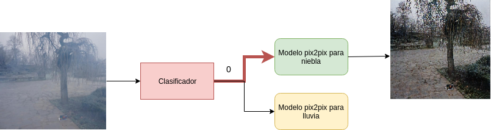
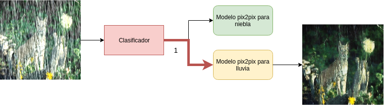
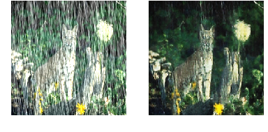
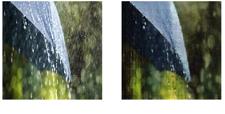
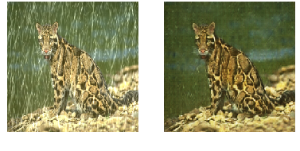
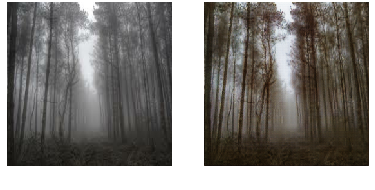
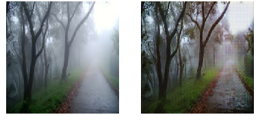
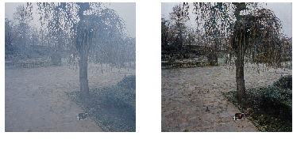

# DeepWeatherCleaner

Este proyecto ha sido desarrolado utilizan modelos de deeplearning con el fin de participar en el concurso organizado por el canal de youtube [Dot CSV](https://www.youtube.com/channel/UCy5znSnfMsDwaLlROnZ7Qbg).

## Objetivo:

Poder remover de imagenes factores climatológicos que pueden dificultar la visión o utilización de estas imagenes, factores tales como la lluvia y la neblina. Por lo cual una de sus utilidades puede ser como lo mencionado Carlos (organizador del evento) en su video titulado [¿Dónde está MI COCHE AUTÓNOMO?](https://www.youtube.com/watch?v=QaZKKYEvT7s). Donde en una parte del video explica la alternativa que sigue Tesla para poder crear autos autónomos, en los que utilizan las cámaras para poder llevar a cabo la tarea de percepción del entorno.

Actualmente el algoritmo puede remover lluvia y niebla de las imágenes. Para esto, lo que hice fue utilizar un modelo de clasificación que se encarga de determinar si una imagen pertenece a la categoría de neblina o de lluvia. Una vez hecho esto, se cuenta con dos modelos con la arquitectura **pix2pix** entrenados para poder remover el factor ambiental que les corresponde de la imagen. Dependiendo del resultado del modelo **clasificador**, se utilizará uno de los dos modelos **pix2pix**. A continuación se mostrará como funciona de una forma más clara la solución propuesta.

### Arquitectura

Como primer capa se tiene al **clasificador** que se encarga de decir si la imagen de entrada es de niebla o de lluvia. El output del **clasificador** puede ser un 0 que indica que es niebla o un 1 que indica lluvia.

Dependiendo de la salida del **clasificador**, se elegirá utilizar uno de los dos modelos **pix2pix** que hay (el de niebla o la lluvia). Una vez elegido el modelo que se va a utilizar, se procesa la imagen y se obtiene la salida sin el factor climatológico correspondiente.

En la primera imagen se puede observar como funcionaría de forma interna el algoritmo para eliminar la niebla de una image y en la segunda imagen se observa el caso de la lluvia.

Se implementó de esta forma, debido a que ayuda a simplificar la complejidad de la traducción de imagenes. Además, se necesitan menos imagenes de entrenamiento para cada uno de los modelos **pix2pix**, al contrario del caso de utilizar un solo modelo **pix2pix** para intentar eliminar la lluvia y la niebla en un mismo modelo.

### Datos del entrenamiento

#### Clasificador

- Epoch: 100.
- Dataset size: 489 imagenes.
- Training dataset: 392 imagenes.
- Testing dataset: 97 imagenes.

#### Pix2pix niebla

- Epoch: 150.
- Dataset size: 75 imagenes.
- Training dataset: 68 imagenes.
- Testing dataset: 7 imagenes.

#### Pix2pix lluvia

- Epoch: 150.
- Dataset size: 200 imagenes.
- Training dataset: 190 imagenes.
- Testing dataset: 10 imagenes.

### Resultado de las pruebas

A continuación se podrán observar varios casos de pruebas realizados sobre la arquitectura completa. Para cada par de imagenes se tiene que a la izquierda está la imagen de entrada y a la derecha la imagen de salida.

 

 

 

Como se puede observar, hay varias imágenes que tienen buenos resultados, a pesar de ser imágenes nunca antes vistas por el modelo. Estos resultados se podrían mejorar con más datos de entrenamiento y variando algunos hiperparametros. Por otra parte, se podría implementar la misma idea, pero con la arquitectura **pix2pixhd** para obtener resultados de mejor calidad.

### Datos sobre mi

Esta será una lista de datos sobre mi.
- Nombre: Gerald Morales Alvarado.
- País: Costa Rica.
- Correo: geraldma1998@gmail.com
- Profesión: Estudiante de ingeniería en computación en el Instituto Tecnológico de Costa Rica.
- Hobby: Uno de mis hobbies es el deeplearning, el cual espero algún día aplicarlo de forma profesional resolviendo problemas de beneficio para la sociedad.
- Otro: Llevo más de 1 año de ver los videos del canal [Dot CSV](https://www.youtube.com/channel/UCy5znSnfMsDwaLlROnZ7Qbg) los cuales me han ayudado a poder aprender sobre diferentes temas o conceptos de deeplearning de una forma sencilla, a comparación a lo que se ve en diferentes tutoriales referentes a esos temas.